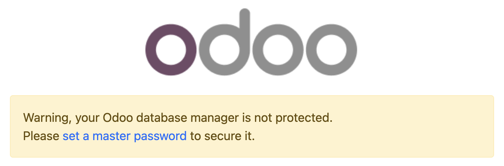

# admin_passwd

## Master password nima va nima uchun kerak?

`admin_passwd` — bu **Odoo ma’lumotlar bazasi boshqaruv interfeysini** (Database Manager) himoyalash uchun ishlatiladigan maxsus kalit. Ushbu parol quyidagi amallarni bajarishda talab qilinadi:

- yangi ma’lumotlar bazasini yaratish;
- mavjud bazani zaxiraga olish (backup);
- bazani qayta tiklash (restore);
- bazani nusxalash yoki o‘chirish;

::: warning Eslatma
`admin_passwd` baza ichidagi **Administrator foydalanuvchi paroli emas**. Admin foydalanuvchi paroli har bir baza ichida alohida saqlanadi. `admin_passwd` esa Odoo server darajasida umumiy bosh himoya mexanizmi sifatida ishlaydi.
:::

## Qayerda belgilanadi?

`admin_passwd` quyidagi fayllardan birida saqlanadi:

1. **Konfiguratsiya faylida** (`odoo.conf`):

```
[options]
; ... boshqa sozlamalar ...
admin_passwd = 7QmYpT6g9d2GATpT2Y4rNwqj8vFsZJrP  ; kuchli, uzun tasodifiy satr
```

2. **Konfiguratsiya fayli ishlatilmagan holatda**:

Parol avtomatik ravishda foydalanuvchi katalogidagi `~/.odoorc` faylida saqlanadi.

::: warning Muhim
Agar `admin_passwd` belgilanmagan bo‘lsa, ayrim Odoo versiyalarida u bo‘sh yoki juda oddiy qiymatga ega bo‘lishi mumkin. Bu xavfsizlik nuqtayi nazaridan juda zaif hisoblanadi. Har doim murakkab va uzun parol belgilang.
:::

## Qanday o‘rnatiladi yoki yangilanadi?

`admin_passwd`ni o‘rnatish yoki yangilashning ikki asosiy usuli mavjud:

### 1-usul: Konfiguratsiya fayli orqali

`odoo.conf` fayliga kerakli qiymat qo‘shiladi yoki yangilanadi.

### 2-usul: Veb-interfeys orqali

Server ishga tushirilgach, brauzerda quyidagi manzil ochiladi:

```
http://<host>:8069/web/database/manager
```

Agar master password hali belgilanmagan bo‘lsa, tizim quyidagi ogohlantirish oynasini ko‘rsatadi:



Bu oynada **Set master password** tugmasi bosiladi va yangi master password kiritiladi.

::: tip Izoh
- "Agar Odoo konfiguratsiya fayli bilan ishga tushirilgan bo‘lsa, kiritilgan parol hashlangan ko‘rinishda shu fayl ichida saqlanadi."
- "Agar konfiguratsiya fayli bo‘lmasa, parol ~/.odoorc fayliga yoziladi."
:::
