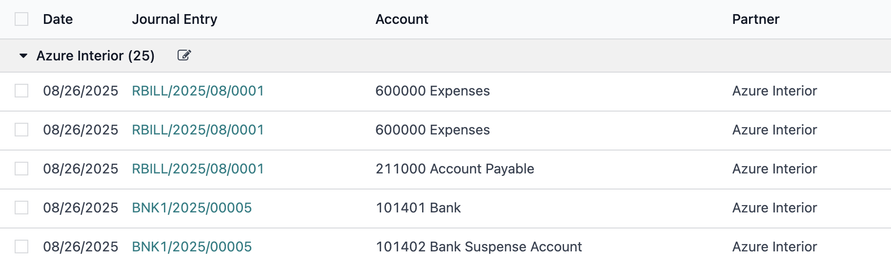

# Edit Button

`type="edit"` bo'lgan button bosilganda formaga kiradi.

```xml

<button type="edit">Activate</button>
```

Belgilangan field bo'yicha group by qilinganda formaga kirish uchun button chiqadi

```xml
<groupby name="partner_id">
    <button name="edit" type="edit" icon="fa-edit" title="Edit"/>
</groupby>
```


